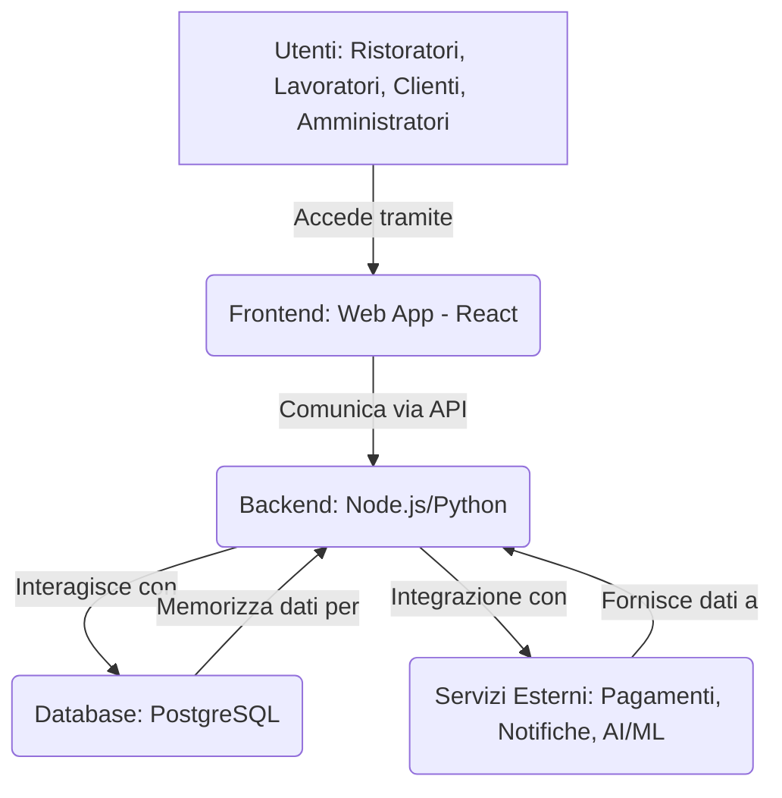

# Architettura Tecnica della Ristorazione Pro League (RPL) Web App

Questo documento descrive l'architettura di sistema e la piattaforma tecnologica proposta per la web application della Ristorazione Pro League (RPL), fornendo una visione d'insieme dei componenti principali e dello stack tecnologico raccomandato.

## 5.1 Componenti Principali dell'Architettura

La web application RPL sarà basata su un'architettura a microservizi o a servizi modulari, per garantire scalabilità, manutenibilità e flessibilità. I componenti principali includeranno:

*   **Frontend (Interfaccia Utente):** L'applicazione web accessibile tramite browser, con interfacce dedicate per Ristoratori, Lavoratori, Clienti e Amministratori RPL. Sarà progettata per essere intuitiva, reattiva e user-friendly.
*   **Backend (Logica di Business e API):** Il cuore del sistema, che gestirà la logica di business, l'autenticazione, l'autorizzazione e fornirà le API (Application Programming Interface) per la comunicazione con il frontend e con eventuali servizi esterni.
*   **Database:** Un sistema di gestione di database robusto e scalabile per la memorizzazione di tutti i dati del sistema (profili utente, dati dei ristoranti, contratti, feedback, risultati audit, ecc.).
*   **Servizi Esterni/Integrazioni:** Moduli per l'integrazione con servizi di terze parti, come sistemi di pagamento, piattaforme di comunicazione (es. notifiche push, email), servizi di geolocalizzazione, o strumenti di analisi dati avanzata.
*   **Moduli di Intelligenza Artificiale (AI) / Machine Learning (ML):** (Futura evoluzione) Per suggerimenti personalizzati (es. percorsi formativi, abbinamenti menu), analisi predittive (es. turnover, sprechi) e ottimizzazione dei processi.

## 5.2 Proposta di Stack Tecnologico

Per garantire robustezza, scalabilità e un'ampia disponibilità di risorse e competenze, si propone il seguente stack tecnologico:

*   **Frontend:**
    *   **Framework:** React (con TypeScript per maggiore robustezza e manutenibilità).
    *   **Librerie UI/CSS:** Bootstrap o Material-UI per un design moderno e responsivo, garantendo una User Experience (UX) coerente e accessibile.
*   **Backend:**
    *   **Linguaggio/Framework:** Node.js con Express.js (o un framework più moderno come NestJS per architetture a microservizi) o Python con FastAPI/Django. La scelta dipenderà dalla complessità dei servizi e dalla preferenza del team di sviluppo.
    *   **Autenticazione/Autorizzazione:** Implementazione di standard OAuth2/JWT per la sicurezza degli accessi.
*   **Database:**
    *   **Relazionale:** PostgreSQL (per la sua affidabilità, scalabilità e supporto a dati complessi).
    *   **(Opzionale) NoSQL:** MongoDB o Redis per la gestione di dati non strutturati o per la caching, se necessario per ottimizzare le performance.
*   **Infrastruttura Cloud:**
    *   **Provider:** Google Cloud Platform (GCP), AWS o Azure per scalabilità, sicurezza e servizi gestiti (es. database gestiti, serverless functions, storage).
    *   **Containerizzazione:** Docker e Kubernetes per la gestione e il deployment dei microservizi, garantendo portabilità e scalabilità orizzontale.

## 5.3 Diagramma: Architettura di Sistema di Alto Livello

**Descrizione del Diagramma:**

Il diagramma sopra illustra l'architettura di alto livello della web application. Gli **Utenti** interagiscono con il **Frontend** (l'applicazione web basata su React). Il Frontend comunica con il **Backend** (sviluppato in Node.js o Python) tramite API. Il Backend è responsabile della logica di business e interagisce con il **Database** per la persistenza dei dati. Inoltre, il Backend si integra con vari **Servizi Esterni** per funzionalità specifiche come pagamenti, notifiche o moduli avanzati di Intelligenza Artificiale/Machine Learning.
